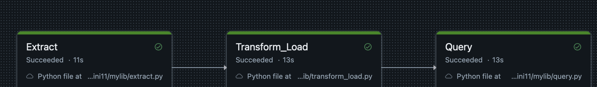
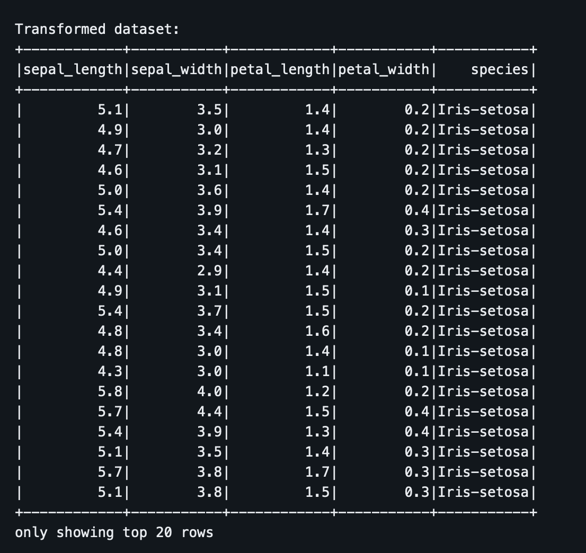
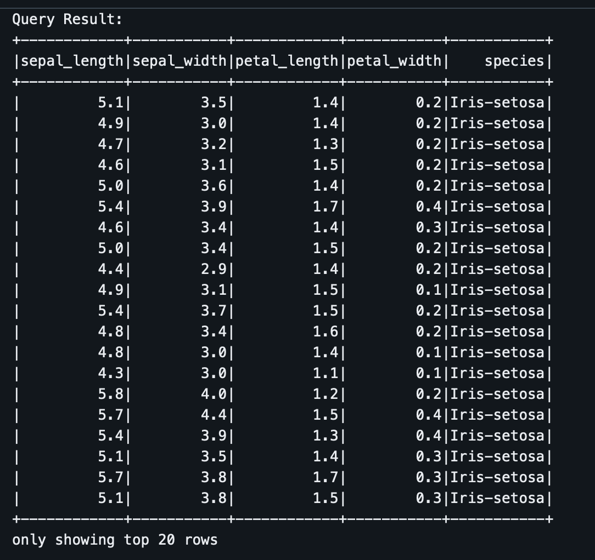

[](https://github.com/Da-Justin-Lin/ids706_dl402_mini11/actions/workflows/cicd.yml)

# ETL Workflow with Databrick

This repository showcases how to use **Databricks** to set up an end-to-end workflow for extracting, transforming, loading, and querying the popular Iris dataset. The project demonstrates the simplicity and power of Databricks in handling data pipelines and analytics.

## Workflow Overview



### 1. **Extract**
The Iris dataset was sourced from the [UCI Machine Learning Repository](https://archive.ics.uci.edu/ml/datasets/iris) or prepackaged in common libraries like `sklearn`. The data was uploaded to Databricks' file system (DBFS) for further processing.

- Data uploaded to `/dbfs/FileStore/tables/iris.csv`.

### 2. **Transform**
Using Databricks' notebooks, the dataset was cleaned and transformed:
- Missing values (if any) were handled.
- Features were normalized.
- Columns were renamed for better clarity.

Code snippet:
```python
from pyspark.sql.functions import col

# Load data
df = spark.read.csv("/FileStore/tables/iris.csv", header=True, inferSchema=True)

# Transformations
df = df.withColumnRenamed("sepal_length", "SepalLength")        .withColumnRenamed("sepal_width", "SepalWidth")        .withColumnRenamed("petal_length", "PetalLength")        .withColumnRenamed("petal_width", "PetalWidth")

# Display transformed data
df.show()
```

### 3. **Load**
The cleaned and transformed data was stored back into a **Delta Table** for efficient querying:
- Data written to Delta Lake.
- Delta Table location: `/FileStore/delta/iris`.

Code snippet:
```python
# Write to Delta
df.write.format("delta").mode("overwrite").save("/FileStore/delta/iris")
```


### 4. **Query**
Databricks' SQL interface was used to query the data:
- Example queries include querying the iris with certain species.



---

## Tools Used
- **Databricks Workspace**: For managing and executing notebooks.
- **DBFS (Databricks File System)**: For file storage.
- **PySpark**: For data transformations.
- **Delta Lake**: For optimized data storage and querying.
- **SQL**: For analytics and insights.

---

## Setup Instructions
1. **Upload the Dataset**:
   - Navigate to the Databricks Workspace.
   - Upload `iris.csv` to the `/FileStore/tables/` directory.

2. **Run the Notebooks**:
   - Execute the provided PySpark code in a Databricks notebook to extract, transform, and load the data.
   - Save the transformed data to Delta Lake.

3. **Query the Data**:
   - Use the SQL editor in Databricks to run the provided queries or create custom ones.
